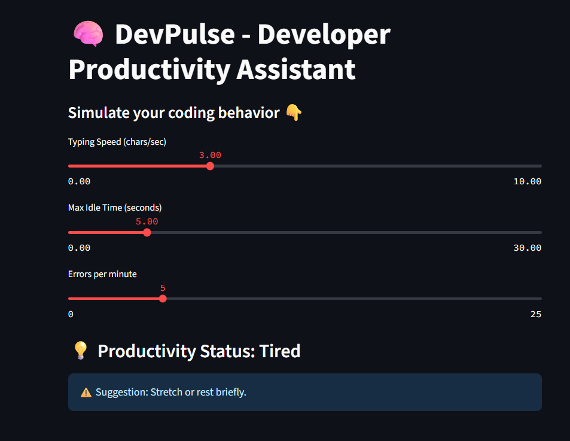

# 🧠 DevPulse – Developer Productivity Assistant

DevPulse is a machine learning project that analyzes typing behavior and predicts a developer’s focus level in real time.

## 🚀 Features
- Simulated developer behavior (typing speed, pause time, error rate)
- Predicts: Focused, Tired, Needs Break
- Real-time web app using Streamlit
- Built with Scikit-learn and Random Forest

## 📁 Project Files
- `data_generator.py` – Generates fake typing data
- `train_model.py` – Trains a Random Forest model
- `app.py` – Streamlit web app for predictions

## 📸 Screenshot


## 🧪 Run the Project

```bash
python data_generator.py
python train_model.py
streamlit run app.py
